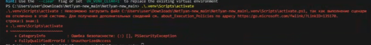

# Troubleshooting

Устранение проблем

## Sound devices

Вызвать список устройств `src\tts\audio_device.py` запустите этот файл

Либо так (активировать venv сначала не забудьте):

```bash
python
import sounddevice as sd
sd.query_devices()
```

CABLE Output
CABLE Input

На Linux могут быть сложности со звуковыми устройствами,

TODO написать как фиксили. Не забудьте перезагрузить ПК после установки виртуального микрофона!

## Windows PowerShell VENV

Если у вас проблемы с активацией venv в Windows PowerShell, например как тут:



можно пофиксить так ([TLDR источник](https://gist.github.com/2ik/3ddbef3263dee8e76b63a391e2ffe5d0)):

Решение проблемы:

- Открываем терминал PowerShell от админа.
- Вставляем и запускаем - Set-ExecutionPolicy RemoteSigned
- На вопрос отвечаем - A

## Пути

CuDNN для Windows (фикс написан в installation), надо добавить путь в PATH Windows и перезагрузить пк и VS Code
