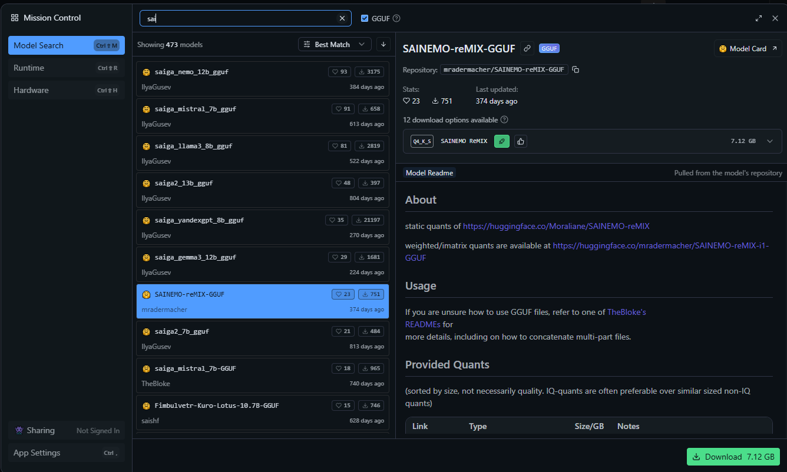
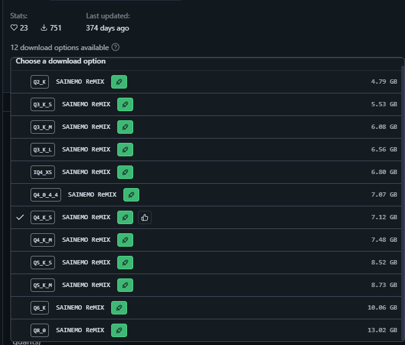
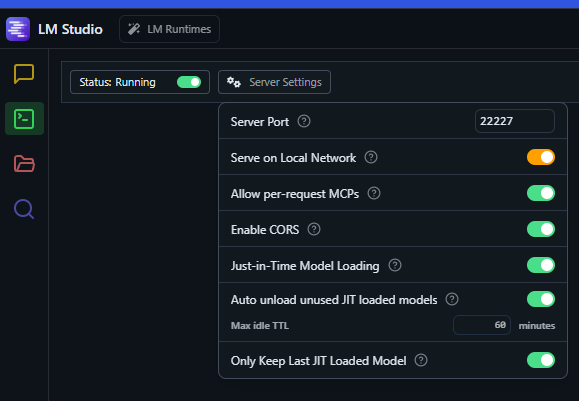
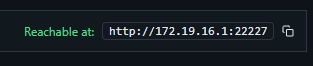

# Local LLM

Запуск LLM локально на примере LM Studio.

## 1. Скачайте и установите [LM Studio](https://lmstudio.ai/)

## 2. Запустите LM Studio и скачайте модели. Нажмите значок поиска и например вбейте `sainemo`

Выберите квантизацию в зависимости от доступной VRAM видеокарты или просто RAM для маков:

Q2 уже совсем малокачественный и туповатый, но заведётся на 6G VRAM, Q3 на 8G, Q4 на 8G+, выше Q4 смысла ставить особо нет.

Загрузите модель и протестите, что она работает в чате. Контекст ставьте 10к токенов, это надо для агентной части.

Оставьте модель загруженной далее.

Также скачайте обязательно маленькую embedding-модельку `cm4ker/USER-bge-m3-Q4_K_M-GGUF` (вставьте в окно поиска его), 250MB, она нужна для RAG-системы. Но если не поставите, тоже будет работать, просто без одной фичи.

## 3. Подсоедините его API-сервер

Запустите его API сервер и установите порт тот же, что в конфиге `.env` указан для LM Studio

Все переменные

- LM_STUDIO_API_BASE
- lm_studio_api_ext
- lm_studio_api

должны вести на этот локальный сервер `http://localhost:22227/v1`, где 22227 - это этот порт, который мы только что указали. Если не работает, попробуйте ввести адрес из самого LM Studio 

(вместо localhost, `/v1` должно остаться)

Посмотрите, чтобы в вашем `.env` было чётко указано

`CORE_LLM_MODEL_NAME="lm_studio/"` и только 1 раз, т.е. без других CORE_LLM_MODEL_NAME объявленных ниже и не закомментированных при помощи `#`.
