# NetTyan App Mindmap

This mindmap represents the flow and structure of the NetTyan application, converted from the original Draw.io diagram.

```mermaid
mindmap
  root((NetTyan App))
    App Choose
      Minecraft
        Nick change
          Server choose
            Own
              Vanilla survival
                Speedrun
                Chill  
                Challenge
            Captcha lobby
              Login lobby
                Main server lobby
                  Minigames menu
                    BedWars
                      Minigame lobby
                        Game start Timer
                          Vote for goods
                          Choose team (island)
                          Game start
                            Resource types
                              Resource type expirience
                              3 resource types - gold, diamond, emeralds
                            Villager shop
                            Own bed protection
                              Wool
                                Wood
                                  Enderite
                                    Obsidian
                              Be near bed
                            Crush other beds
                            Kill enemies
                              Near your bed
                                Randoms without bed
                                  Other Randoms
                            Respawn chill
                              Obstruct teammates
                              Communicate
                                Chat
                                Gestures
                    SkyWars
                      Minigame lobby
                        Game start Timer
                          Vote for goods
                          Choose team (island)
                          Game start
                            Loot chests
                              Get build materials
                                Explore other islands (chests)
                            Get armor & weapons
                              Kill enemies
                                Win
                            Try to find teammates
                              Try to team with randoms
                                be betrayed and lose [95%]
                              Team with friendlist
                                play with teammate [5%]
                                  give loot to teammate
                                  communicate
                                  mess & fun with build
                              Team SW mode
                    MurderMystery
                      Minigame lobby
                        Game start Timer
                          Game start
                            Innocent
                              Determine killer
                                Collect gold
                                  Get weapon
                                    Kill the killer
                                      Win
                                    Threaten innocents
                            Killer
                              Kill everyone now [efficient/boring]
                              Kill alone victims
                              Show bow like you detective
                              Dont kill [clown & fun]
                                Threaten innocents with knife
                                Chill
                              Collect gold [same path as innocent]
                                Get weapon [same path as innocent]
                                  Kill the killer [same path as innocent]
                                    Win
                                  Threaten innocents [same path as innocent]
            Random
              Operation loop
            Donate Survival
              Spawn chill
                Gestures
                Communicate
              /warp
                Warp pvp
              /rtp
                Ask friend to rg add
                Avoid regions
                Build & private own region
              Moders and strict rules
                Death / jailed / kicked / banned
              Stupid admins griefers
                Death / jailed / kicked / banned
```

## Key Features and Flow

### Main Game Modes

1. **BedWars**: Team-based strategy game with resource management and bed protection
2. **SkyWars**: Solo/team survival game with looting and PvP mechanics  
3. **MurderMystery**: Social deduction game with roles (Innocent/Killer)

### Survival Mode

- **Donate Survival**: Premium survival server with various gameplay options
- **Random Teleport (/rtp)**: Explore and build in protected regions
- **PvP Warps**: Combat-focused areas
- **Moderation**: Strict rules with consequences for violations

### Lobbies and Social Features

- **Lobby Chill**: Social spaces for communication and gestures
- **Captcha System**: Anti-bot protection
- **Friend System**: Team up with known players for better coordination

### Game Mechanics

- **Resource Management**: Gold, diamonds, emeralds as currency
- **Protection Systems**: Bed protection, region protection
- **Communication**: Chat and gesture systems
- **Team Coordination**: Sharing loot and strategic planning

This mindmap captures the complex decision tree and user journey through the NetTyan Minecraft server application, showing various game modes, social features, and progression paths.
